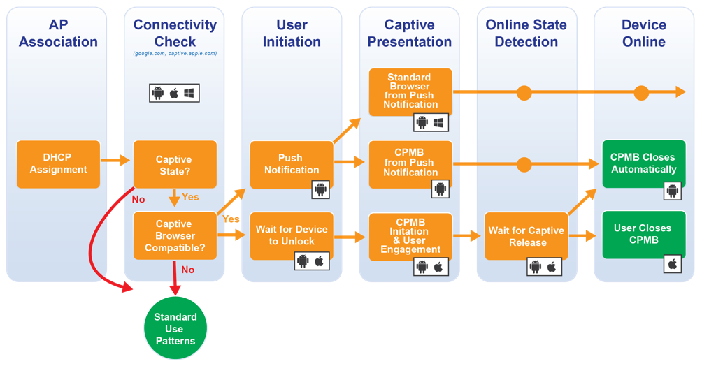

# Work on captive portal

## References

 * [Captive Network Portal Behavior](https://captivebehavior.wballiance.com/#windows-anchor)
 * [CAPTIVE PORTAL: The Definitive Guide](https://rootsh3ll.com/captive-portal-guide/)
 
 
## Brands

* Android
    - qsdf
* Apple
    - [How to modernize your captive network](https://developer.apple.com/news/?id=q78sq5rv)
* Microsoft
    - [Captive portals](https://docs.microsoft.com/en-us/windows-hardware/drivers/mobilebroadband/captive-portals)
    - [Detecting Captive Network Portals](https://docs.microsoft.com/fr-fr/archive/blogs/ieinternals/detecting-captive-network-portals)
    - [Une fenêtre Internet Explorer ou une fenêtre Edge s’ouvre lorsque votre ordinateur se connecte à un réseau d’entreprise ou à un réseau public](https://docs.microsoft.com/fr-be/troubleshoot/windows-client/networking/internet-explorer-edge-open-connect-corporate-public-network)
    - [Introduction to integrating Windows with wireless hotspots](https://docs.microsoft.com/en-us/windows-hardware/drivers/mobilebroadband/integrating-windows-with-wireless-hotspots)

## Linux

* [https://success.tanaza.com/s/article/How-Automatic-Detection-of-Captive-Portal-works](https://success.tanaza.com/s/article/How-Automatic-Detection-of-Captive-Portal-works)
* [https://developer.android.com/about/versions/11/features/captive-portal](https://developer.android.com/about/versions/11/features/captive-portal)
*  PyFi Spot
    - [https://github.com/humitos/pyfispot](https://github.com/humitos/pyfispot)
    - [https://github.com/humitos/pyfispot/tree/master/raspberrypi](https://github.com/humitos/pyfispot/tree/master/raspberrypi)
* captive_portal
    - [https://github.com/AloysAugustin/captive_portal](https://github.com/AloysAugustin/captive_portal)
* nodogsplash
    - [https://trevphil.com/posts/captive-portal](https://trevphil.com/posts/captive-portal)
    - [https://www.maketecheasier.com/turn-raspberry-pi-captive-portal-wi%E2%80%90fi-access-point/](https://www.maketecheasier.com/turn-raspberry-pi-captive-portal-wi%E2%80%90fi-access-point/)
    - [https://pimylifeup.com/raspberry-pi-captive-portal/](https://pimylifeup.com/raspberry-pi-captive-portal/)
* openNDS 
    - [https://github.com/openNDS/openNDS](https://github.com/openNDS/openNDS)
* go-captive
    - [https://github.com/hsanjuan/go-captive](https://github.com/hsanjuan/go-captive)

