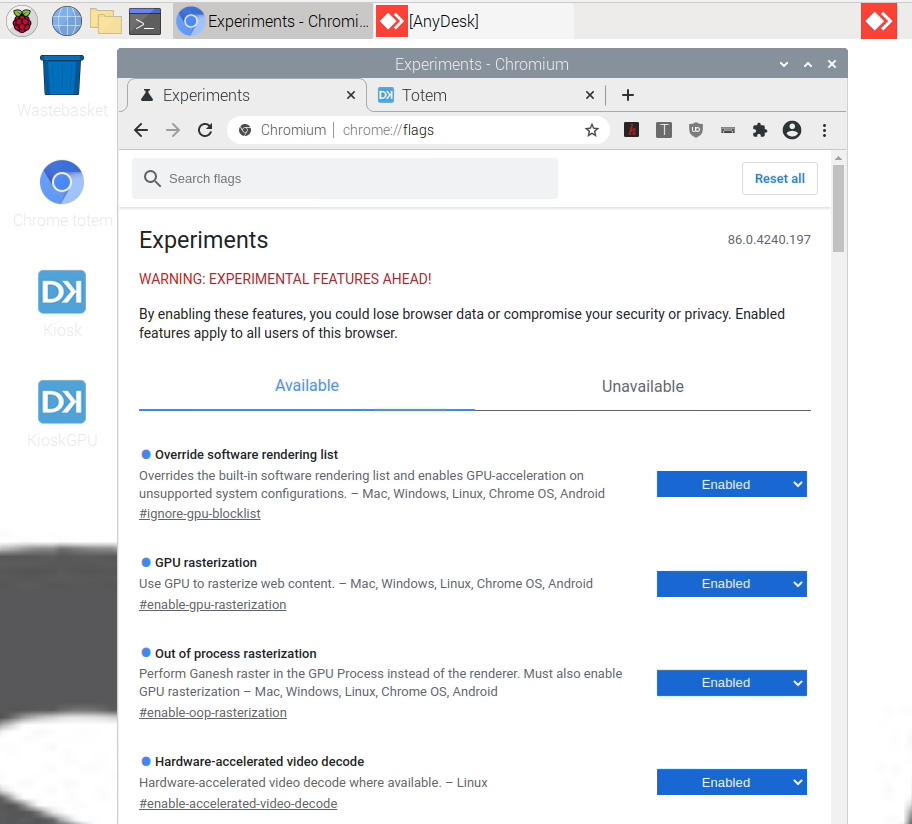
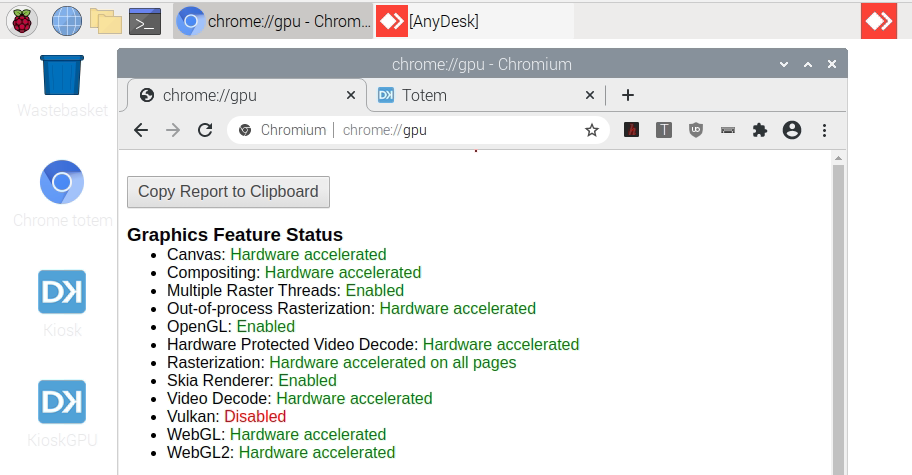

# Chromium GPU options for Pi 4
*Enable Pi 4 GPU Video Decode hardware accelerated.*

As of january 2021, Chromium command line options for GPU have no effect:


```bash
--ignore-gpu-blocklist
--enable-gpu-rasterization
--enable-oop-rasterization
--enable-accelerated-video-decode
```
 
Therefore we have to enable GPU options in Chromium `chrome://flags`

Log normally (as `edkuser`) and open Chromium at `chrome://flags` and locate and enable the following options:



Then relaunch Chromium and verify at `chrome://gpu`




## Sources

* [https://lemariva.com/blog/2020/08/raspberry-pi-4-video-acceleration-decode-chromium](https://lemariva.com/blog/2020/08/raspberry-pi-4-video-acceleration-decode-chromium)